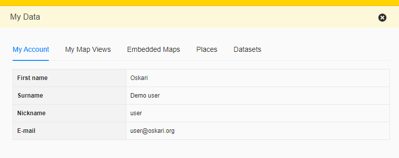

# mydata

Provides generic container for user data and offers other functionalities a way to present user-specific information.

## Description

The bundle lists user's account information and saved data in the application.
By default mydata lists account info, saved map views and embedded maps.
Other bundles can add tabs to list data related to their domain (eg. my places, user indicators) here.



*Here shown with tabs added by `myplaces` and `myplacesimport` bundles*

## TODO

* Move embedded maps tab implementation from mydata to publisher functionality

## Usage from other bundles

If `mydata` bundle is present in the app (and started before running this code) other bundles can access the service it provides through the Oskari sandbox. The provided service has a function `addTab()` that takes the following parameters:

- identifier for the tab/functionality (some unique id as string like the bundle id that is adding the tab)
- title for the tab that is shown to end-user
- React-component that will be used to render the tab contents
- UIHandler instance for the React-component https://oskari.org/jsdoc/latest/oskari-ui-util/controllerMixin.html

```javascript
const myDataService = sandbox.getService('Oskari.mapframework.bundle.mydata.service.MyDataService');
if (myDataService) {
    myDataService.addTab('[identifier string for tab]', 'Title for tab', MyTabImpl, MyTabImplUIHandler);
}
```
The UIHandler is expected to have `addStateListener()`, `getState()` (inherited from `StateHandler`) and `getController()` (from `controllerMixin`) functions. The objects returned by `getState()` and `getController()` functions are passed to the React-component as props `state` and `controller`. When a statechange is triggered on the `MyTabImplHandler` the UI will be re-rendered (by the state listener registered by `mydata`).

Example `MyTabImplUIHandler`:
```javascript
class UIHandler extends StateHandler {
     changeState () {
         this.updateState({ updated: 'state' });
     }
};
export const MyTabImplUIHandler = controllerMixin(UIHandler, ['changeState']);
```

Example `MyTabImpl`:
```javascript
export const MyTabImpl = ({ state, controller }) => {
  return (<p>
    My state: {{JSON.stringify(state)}}
    <button onClick={() => controller.changeState()}>Do stuff</button>
  </p>)
}
```
## Bundle configuration

Configuration is optional:

```javascript
conf: {
  showUser: true,
  showViews: true
}
```

- If `showUser` is `true` (defaults to true on server) the user account tab will be shown.
- If `showViews` is `true` (defaults to true on server) the saved views tab will be shown.

These can be configured on the Oskari-server `oskari-ext.properties` configuration file:
```
mydata.tabs.showUser=true
mydata.tabs.showViews=true
```

Also uses `Oskari.urls.getLocation('profile')` to provide a link where the user can update their profile information.
The easiest way for the link to be configured is defining it on the Oskari-server `oskari-ext.properties` configuration file:
```properties
auth.profile.url=/profile
```
Or for language-specific links with:
```properties
auth.profile.url.en=https://sso.org/profile
auth.profile.url.fi=https://sso.org/profiili
```

The bundle will show a link on the account tab to the configured URL when configured.

## Requests the bundle sends out

<table class="table">
<tr>
  <th> Request </th>
  <th> Where/why it's used</th>
</tr>
<tr>
  <td> `Publisher.PublishMapEditorRequest` </td>
  <td> When an embedded maps 'Edit' link is clicked to activate the publisher bundle </td>
</tr>
<tr>
  <td> `userinterface.UpdateExtensionRequest` </td>
  <td> When an embedded maps 'Edit' link is clicked to close the personaldata flyout </td>
</tr>

<tr>
  <td> `Toolbar.AddToolButtonRequest` </td>
  <td> If 'StateHandler.SaveStateRequest' can be used/is part of the application.
  Adds a toolbar button for saving views when the bundle is started.
  Button is disabled for guest users.</td>
</tr>
<tr>
  <td> `StateHandler.SaveStateRequest` </td>
  <td> When the save view button is clicked </td>
</tr>
<tr>
  <td> `StateHandler.SetStateRequest` </td>
  <td> When the name of a saved view or 'Show' link of an embedded map is clicked </td>
</tr>

</table>

## Events the bundle listens to

<table class="table">
  <tr>
    <th> Event </th><th> How does the bundle react</th>
  </tr>
  <tr>
    <td> `Publisher.MapPublishedEvent` </td><td> Refreshes the embedded maps listing </td>
  </tr>
  <tr>
    <td> `StateSavedEvent` </td><td> Refreshes the saved views listing </td>
  </tr>
  
</table>

## Dependencies

<table class="table">
  <tr>
    <th>Dependency</th>
    <th>Linked from</th>
    <th>Purpose</th>
  </tr>
  <tr>
    <td> [Oskari divmanazer](/api/bundles#/latest/ui/divmanazer)</td>
    <td> Expects to be present in application setup </td>
    <td> Bundle has a Flyout and Tile so a divmanazer is needed </td>
  </tr>
</table>
