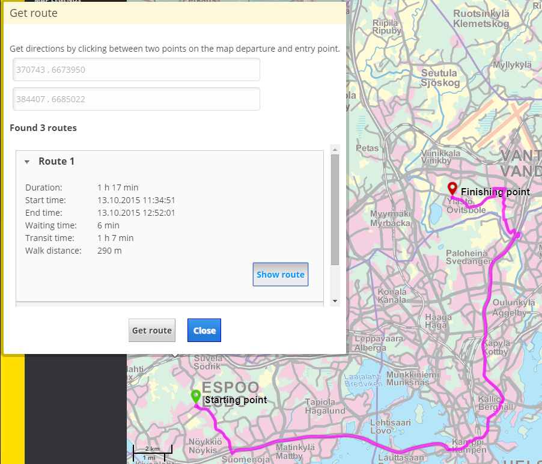

# routingUI

## Description

This bundle provides UI for routing. In this bundle user can select start and end points of route and then search route of between these points. Finally results are showed on the popup.

## Screenshot

## Bundle configuration

No configuration is required. 

## Bundle state

No statehandling has been implemented.

## Requests the bundle handles

This bundle doesn't handle any requests.

## Requests the bundle sends out

<table class="table">
  <tr>
    <th> Request </th><th> Where/why it's used</th>
  </tr>
  <tr>
    <td>`GetRouteRequest`</td><td> Get route plan.</td>
  </tr>
  <tr>
    <td>`MapModulePlugin.AddFeaturesToMapRequest`</td><td> Add route plan geometry to map.</td>
  </tr>
  <tr>
    <td>`MapModulePlugin.RemoveFeaturesFromMapRequest`</td><td> Remove route plan geometry from map.</td>
  </tr>
  <tr>
    <td>`MapModulePlugin.AddMarkerRequest`</td><td> Add route start and end point to map.</td>
  </tr>
  <tr>
    <td>`MapModulePlugin.RemoveMarkersRequest`</td><td> Remove route start and end points from map.</td>
  </tr>
</table>

## Events the bundle listens to

<table class="table">
  <tr>
    <th>Event</th><th>How does the bundle react</th>
  </tr>
  <tr>
    <td>`MapClickedEvent`</td><td>Updates the coordinates gotten from event to the UI.</td>
  </tr>
  <tr>
    <td>`RouteResultEvent`</td><td>Updates the route plans to the UI.</td>
  </tr>  
</table>

## Events the bundle sends out

This bundle doesn't send any events.

## Dependencies

<table class="table">
  <tr>
    <th>Dependency</th><th>Linked from</th><th>Purpose</th>
  </tr>
  <tr>
    <td>[jQuery](http://api.jquery.com/)</td>
    <td>Assumes to be linked in the page</td>
    <td>Used to create the component UI from begin to end</td>
  </tr>
  <tr>
    <td>[Moment.js](http://momentjs.com/)</td>
    <td>Bundle</td>
    <td>Used to format date/time</td>
  </tr>
</table>
