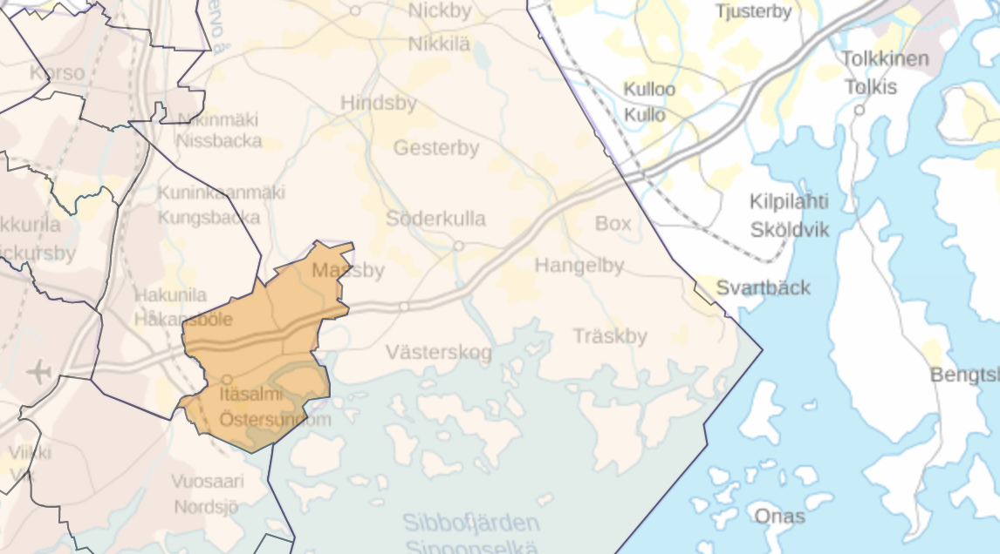

# wfsvector

## Description

Alternative implementation of mapwfs2 that uses MVT vector tiles or geojson as data transfer mechanism. Requires module `control-mvt` to be in use in the backend. Currently supports functionalities:

- Displays WFS layer features on the map
- Shows feature infobox on click
- Notifies with events about currently visible feature properties (shown by Featuredata2 bundle in Feature Data flyout)
- Allows feature selection by feature id (WFSFeaturesSelectedEvent) or by geometry filter (WFSSetFilter)
- Temporary click interaction disabling (ActivateHighlightRequest)

Does not support:

- Layer styling
- Feature selection based on feature properties (WFSSetPropertyFilter)
- No special handling for "Manual refresh" type layers
- Sending of clicked feature geometry as event

## Screenshot



## Plugin config

<table class="table">
  <tr>
    <th>Property</th><th>Value type</th>
  </tr>
  <tr>
    <td>renderMode</td><td>"mvt"|"vector"</td>
    <td>origin</td><td>number[2]</td>
    <td>resolutions</td><td>number[]</td>
    <td>tileSize</td><td>number</td>
  </tr>
</table>

```javascript
{
  "renderMode": "mvt",
  "origin": [-548576, 8388608],
  "resolutions": [8192, 4096, 2048, 1024, 512, 256, 128, 64, 32, 16, 8, 4, 2, 1, 0.5, 0.25],
  "tileSize": 256
}
```

## Requests the plugin handles

<table class="table">
  <tr>
    <th>Request</th><th>How does the bundle react</th>
  </tr>
  <tr>
    <td>WfsLayerPlugin.ActivateHighlightRequest</td><td>Disbale/enable map click selection interaction for WFS layers</td>
  </tr>
</table>

## Requests the plugin sends out

<table class="table">
  <tr>
    <th>Request</th><th>Why/when</th>
  </tr>
  <tr>
    <td> InfoBox.ShowInfoBoxRequest </td><td> Show clicked feature properties </td>
  </tr>
</table>

## Events the bundle listens to

<table class="table">
  <tr>
    <th> Event </th><th> How does the bundle react</th>
  </tr>
  <tr>
    <td> AfterMapMoveEvent </td><td> Updates feature properties visible. </td>
  </tr>
  <tr>
    <td> AfterMapLayerAddEvent </td><td> Registers layer with WFS service. </td>
  </tr>
  <tr>
    <td> AfterMapLayerRemoveEvent </td><td> Removes layer from WFS service. </td>
  </tr>
  <tr>
    <td> WFSFeaturesSelectedEvent </td><td> Updates layer style to reflect selection. </td>
  </tr>
  <tr>
    <td> MapClickedEvent </td><td> Open infobox or hilight feature (control-click) </td>
  </tr>
  <tr>
    <td> MapLayerVisibilityChangedEvent </td><td> Update layer visibility. </td>
  </tr>
  <tr>
    <td> AfterChangeMapLayerOpacityEvent </td><td> Update layer opacity. </td>
  </tr>
  <tr>
    <td> WFSSetFilter </td><td> Apply geometry filter and select features. </td>
  </tr>
</table>

## Dependencies

<table class="table">
  <tr>
    <th>Dependency</th><th>Linked from</th><th>Purpose</th>
  </tr>
  <tr>
    <td> [Oskari infobox](/documentation/bundles/framework/infobox) </td>
    <td> Oskari's InfoBoxBundle </td>
    <td> That handles the infobox as an Openlayers popup with customized UI</td>
  </tr>
</table>
