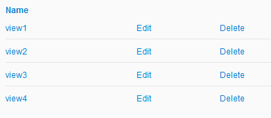

# Grid & GridModel

## Description

A Grid can render a given GridModel as a table. Its features include column aliases, calling external handlers for nested tables, field-specific value renderers,
sorting and selections.

A GridModel is a simple data container that keeps track of key fields and provides convenience methods for addition of structured data.

## Screenshot



## Usage

```javascript
var gridModel = Oskari.clazz.create('Oskari.userinterface.component.GridModel');
var grid = Oskari.clazz.create('Oskari.userinterface.component.Grid');
var idRenderer = function(id, data) {
  // set what happens when the 'id' field is clicked
  var idLink = jQuery('<span class="idlink">' + id '</span>');
  idLink.bind('click', function() {
    showDetails(data);
    return false;
  });
  return idLink;
};

for (var i = 0; i < dataArray.length; ++i) {
  gridModel.addData(dataArray[i]);
}
gridModel.setIdField('id');
grid.setDataModel(gridModel);
grid.setVisibleFields([ 'id', 'afield', 'anotherfield' ]);
grid.setColumnValueRenderer('id', idRenderer);
grid.setColumnUIName('afield', localisations.afield);
grid.setColumnUIName('anotherfield', localisations.anotherfield);

// If you want use paging you can also define grid for this way
// Set grouping header, only grouping headers allows use paging
me.grid.setGroupingHeader([
    {
        // first grouping cell is same for all others cells, for example same title
        // define grouping cell style class
        cls: 'grouping-header-1',
        // define grouping header text
        text: 'Header 1'
    },
    {
        // this we use at all others than first cell has own grouping header
        // define grouping cell style class
        cls:'grouping-header-2',
        // define grouping header text
        text: 'Header 2',
        // define how many cells is maximum count. If cols are more than this then shows paging arrows
        maxCols: 2,
        /* define paging handler. Handler return text element and data obtains information on paging. data object is following:
        {
          visible: {
            start: 2,
            end: 3
          },
          count: 6,
          page: 1,
          maxPages: 3
        }
        Object tells:
        - visible: tells at showing now cells 2 - 3
        - count: tells at there is 6 cells
        - page: tells at you are now page 1
        - maxPages: tells at there is 3 pages
        */
        pagingHandler: function(element, data){
            element.html('Data ' + '<span>('+data.visible.start + '-' + data.visible.end +'/' + data.count+')</span>');
        }
    }
]);


grid.renderTo(someElement);

// select row and scroll table to selected
var scrollableObject = {
  element: jQuery('.scrallobleElement'),
  fixTopPosition: 16 // if need fix calculated top position then use this number. Number means at how many pixels are decreased in calculated element row top location.
  }:
grid.select(wantedRowValue, false, scrollableObject);

// moves selected rows as first rows of the table
grid.moveSelectedRowsTop(true);

// Resumes current ordering of the rows (if not table is not sorted, rows remain as is)
grid.moveSelectedRowsTop(false);
```

## Dependencies

<table class="table">
  <tr>
    <th>Dependency</th><th>Linked from</th><th>Purpose</th>
  </tr>
  <tr>
    <td> [jQuery](http://api.jquery.com/) </td>
    <td> Version 1.7.1 assumed to be linked on the page</td>
    <td> Used to create the component UI from begin to end</td>
  </tr>
</table>
